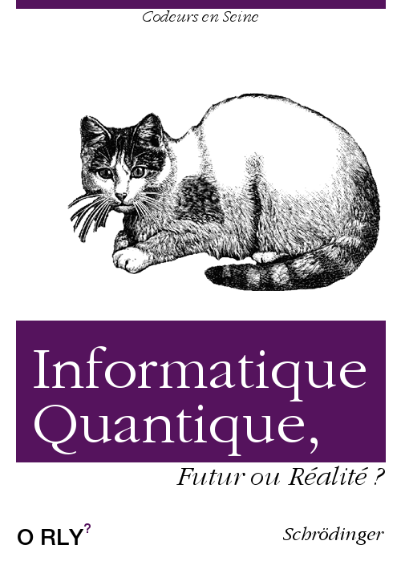

# Résumé conférence Codeur en Seine 2018 Killian CHAMBELLANT

## Cartouche d'identification

 - Manifestation : CodeursEnSeine 2017
 - Lieu : Kindarena
 - Conférence : *Informatique Quantique, Futur ou Réalité ?*
 - Horaire de la conférence : 15h40
 - Durée de la conférence : 1 heure
 - Conférencier(s) :
   - Robin Szylobryt: [LinkedIn](https://www.linkedin.com/in/robin-szylobryt-02b656160/?originalSubdomain=fr)
 - Audience : ~150 personnes
 - Auteur du billet : Killian CHAMBELLANT
 - Mots-clés : 
   * Informatique quantique
   * Qubit
   * Microprocesseur
 - URL de l'illustration : 

## Support
 - Support non disponible
 - Plan du support :
   * Qu'est-ce que l'informatique quantique ?
   * Un peu d'Histoire
   * La révolution quantique
   * Notions clefs
   * Ordinateur quantique
   * Mythe ou réalite ?

## Résumé
...

## Architecture et facteur qualité
...
